# KẾ HOẠCH PHÁT TRIỂN CHI TIẾT – TUẦN 1: PROJECT SETUP & CORE PROTOTYPE

**Dự án:** Yên Tử: Phát Môn Cổ Kính (_Yên Tử: Tráng Hành Ký_)  
**Công nghệ:** Unity 6 (6000.4.6f1) URP + C# (VS Code) + Netcode for GameObjects (NGO) + Cinemachine  
**Quy mô Co-op:** 1–5 người chơi (Solo / Online Co-op linh hoạt, Dynamic Scaling)  
**Mục tiêu cột mốc Tuần 1 (Milestone 1):** Bản build prototype có thể chơi được (Playable Prototype), hỗ trợ 1–5 người chơi kết nối qua Host/Join LAN/Localhost, điều khiển nhân vật di chuyển góc nhìn thứ 3 với camera Cinemachine FreeLook trên bản đồ Greybox Suối Giải Oan có NavMesh.

---

## 1. TỔNG QUAN KIẾN TRÚC KỸ THUẬT (TECHNICAL ARCHITECTURE)

```mermaid
flowchart TD
    subgraph Client_Input_Camera ["Thành viên A: Player & Camera"]
        Input["Unity Input System\n(PlayerInputActions)"]
        Cam["Cinemachine FreeLook Camera\n(Orbit 3rd Person)"]
        Ctrl["PlayerController.cs\n(Di chuyển, Xoay theo Cam, Jump)"]
        State["PlayerCharacterBase.cs\n(State Machine & NetworkVariable)"]
        Input --> Ctrl
        Cam -.->|Camera Y-Angle| Ctrl
        Ctrl --> State
    end

    subgraph Network_Session ["Thành viên B: NGO Networking"]
        NetUI["NetworkManagerUI.cs\n(UGUI: Host 5P / Join IP)"]
        GameMgr["YenTuGameManager.cs\n(Server Authoritative Spawner)"]
        SpawnPoints["5x PlayerStart Points\n(Spawn With Ownership)"]
        NetUI --> GameMgr
        GameMgr --> SpawnPoints
        State <==>|Sync State & Transform| GameMgr
    end

    subgraph Environment_AI ["Thành viên C: Level & Pathfinding"]
        Greybox["Greybox Map Suối Giải Oan\n(ProBuilder / Primitives + Colliders)"]
        Nav["NavMesh Surface\n(Bake cho U Ảnh & Bạch Hổ)"]
        SpawnPoints -.->|Tọa độ trên Map| Greybox
        Greybox --> Nav
    end
```



---

## 2. LỘ TRÌNH THỰC HIỆN THEO NGÀY (DAY-BY-DAY ROADMAP)

| Ngày       | Thành viên A (Lead / Gameplay)                                                                                                            | Thành viên B (Multiplayer / System)                                                                                    | Thành viên C (Level / AI Environment)                                                                                                                 | Toàn đội (Milestone & Integration)                                                                              |
| :--------- | :---------------------------------------------------------------------------------------------------------------------------------------- | :--------------------------------------------------------------------------------------------------------------------- | :---------------------------------------------------------------------------------------------------------------------------------------------------- | :-------------------------------------------------------------------------------------------------------------- |
| **Ngày 1** | Hoàn thành TASK-ALL-001 (Setup thư mục, `.gitattributes`, Git LFS, README). Tạo nhánh cá nhân `feature/A-character-controller`.           | Kiểm tra `manifest.json`, cài đặt Netcode for GameObjects (NGO) và Unity Transport. Tạo nhánh `feature/B-ngo-session`. | Khảo sát concept Suối Giải Oan trong [KICHBAN.MD](KICHBAN.MD), cài đặt package ProBuilder & AI Navigation. Tạo nhánh `feature/C-greybox-suoigiaioan`. | Họp Kick-off Tuần 1, phân chia nhánh và thống nhất quy trình Pull Request (PR) vào `dev`.                       |
| **Ngày 2** | Thiết kế Enum `ECharacterState`, viết khung State Machine trong `PlayerCharacterBase.cs`.                                                 | Viết `NetworkManagerUI.cs` & `SessionManager.cs` tạo giao diện nhập IP và nút bấm Host (Max 5P) / Join.                | Phác thảo Blockout 2D/3D sơ đồ địa hình Suối Giải Oan (Độ cao, suối, cầu đá, Boss Arena).                                                             | Hoàn thành bộ khung mã nguồn cơ bản của từng người, push commit đầu tiên lên remote.                            |
| **Ngày 3** | Cài đặt package `Cinemachine`, tạo `CinemachineFreeLook` Camera Orbit xoay theo chuột. Cấu hình New Input System (`WASD`, `Mouse Delta`). | Viết `YenTuGameManager.cs`: Đăng ký sự kiện `OnClientConnectedCallback`, lập trình logic cấp phát Player Index 1–5.    | Dựng hình khối 3D (ProBuilder/Primitives) khu vực Xuất phát (5 điểm spawn) và Đoạn đường ven suối.                                                    | Sync tiến độ giữa Ngày 3, kiểm tra các package không bị xung đột phiên bản trong `Packages/`.                   |
| **Ngày 4** | Lập trình di chuyển 8 hướng mượt mà, nhân vật tự động xoay hướng theo góc nhìn Camera (`Smooth Rotation`). Thêm Sprint (`Left Shift`).    | Lập trình cơ chế Spawning qua `NetworkObject.SpawnWithOwnership(clientId)` và quản lý danh sách `connectedClientIds`.  | Dựng khu vực Cầu Đá gãy (khu vực Puzzle Ánh Sáng) và Sân đấu Boss 1 (Boss Arena) rộng rãi, bằng phẳng.                                                | Thành viên A export Prefab `PF_Player_Minh` tạm thời để Thành viên B dùng test logic spawn.                     |
| **Ngày 5** | Hoàn thiện tính toán trọng lực, Nhảy (`Space`), kiểm tra `Grounded`. Thêm phím test đổi State hiển thị trên Console.                      | Test luồng Host/Join 2 client trên Localhost; xử lý Client Disconnect để dọn dẹp Player Object.                        | Thiết lập toàn bộ Collider chống rơi map; gắn `NavMeshSurface`, cấu hình Agent Radius/Height và Bake NavMesh.                                         | Thử nghiệm thả `NavMeshAgent` test chạy thử trên địa hình của C để xác nhận đường đi thông suốt.                |
| **Ngày 6** | Tích hợp `NetworkTransform` vào Player Prefab; mở PR merge vào nhánh `dev`.                                                               | Hoàn thiện UI HUD hiển thị danh sách client kết nối; mở PR merge vào nhánh `dev`.                                      | Hoàn thiện 5 vị trí `PlayerStart` chuẩn tọa độ; mở PR merge vào nhánh `dev`.                                                                          | **Integration Phase:** Review & Merge cả 3 PR vào `dev`. Mở scene chung `SC_SuoiGiaiOan_Prototype` để playtest. |
| **Ngày 7** | Sửa lỗi Camera jitter hoặc xoay sai trục.                                                                                                 | Sửa lỗi mất đồng bộ vị trí giữa Host và Client.                                                                        | Bổ sung rào chắn vô hình (Invisible Colliders) tại mép vực nguy hiểm.                                                                                 | **Đóng gói Build Tuần 1 (`Build_Week01_Standalone.exe`)**. Họp Retro nghiệm thu Tuần 1 và chốt Task Tuần 2.     |

---

## 3. BẢNG ĐẶC TẢ CHI TIẾT TỪNG TICKET CÔNG VIỆC

### 👥 TOÀN TEAM: TASK-ALL-001 – Project Foundation & Packages

- **Nhiệm vụ:** Thiết lập cấu hình dự án, Git LFS, cấu trúc thư mục và dependencies chuẩn.
- **Tập tin cấu hình:**
  - [`.gitattributes`](.gitattributes): Đã cấu hình LFS cho binary assets (`.unity`, `.prefab`, `.fbx`, `.png`, `.mat`, `.wav`).
  - [`README.md`](README.md): Đã lưu quy chuẩn Naming Convention, Branching Strategy (`main`, `dev`, `feature/`).
  - [`Packages/manifest.json`](Packages/manifest.json): Bổ sung các package thiết yếu:
    - `"com.unity.netcode.gameobjects": "2.2.0"` (hoặc phiên bản tương thích Unity 6)
    - `"com.unity.cinemachine": "3.1.2"` (hoặc Cinemachine 2.x/3.x)
    - `"com.unity.probuilder": "6.0.4"`
    - `"com.unity.ai.navigation": "2.0.12"` (Đã có sẵn)
- **DoD (Definition of Done):** Toàn bộ 3 thành viên clone repo, mở Unity Editor không báo lỗi Missing Packages; nhánh `dev` sẵn sàng hoạt động.

---

### 🗡️ THÀNH VIÊN A: LEAD / GAMEPLAY ARCHITECT

#### 🎫 TICKET A-001: Character Base & State Machine Framework

- **Context:** Cần lớp C# gốc quản lý trạng thái, vòng đời và thuộc tính cho **nhóm người chơi (Minh, Khang, Linh, An, và Slot 5)**. Tách biệt hoàn toàn khỏi NPC (Lê Thánh Tông, Cấm Quân kế thừa `NPCBase`).
- **Mã nguồn chính:** `Assets/_Project/Characters/Scripts/PlayerCharacterBase.cs`
- **Chi tiết kỹ thuật:**
  1. **Enum `ECharacterState`:**
     ```csharp
     public enum ECharacterState
     {
         Idle,          // Đứng yên
         Moving,        // Đi bộ / chạy thường
         Sprinting,     // Chạy nhanh tiêu hao thể lực
         InAir,         // Đang nhảy / rơi
         Attacking,     // Đang ra đòn (Light/Heavy/Skill)
         Dodging,       // Lướt né đòn (Invulnerability Frames)
         Blocking,      // Giơ vũ khí / khiên đỡ đòn (Parry Window)
         Climbing,      // Leo trèo địa hình / mai rùa / thân cây
         Interacting,   // Kích hoạt cơ quan / xoay gương / cắm ấn
         Staggered,     // Bị choáng khi vỡ thế
         Downed,        // Ngã gục chờ cứu (Co-op 1-5 người)
         Dead           // Chết, chuẩn bị hồi sinh tại Trạm Hương
     }
     ```
  2. **Quản lý Trạng thái Mạng (NGO):**
     - Kế thừa từ `NetworkBehaviour`.
     - Sử dụng `public NetworkVariable<ECharacterState> CurrentState` với quyền ghi Server-Authoritative (`NetworkVariableWritePermission.Server`).
     - Viết hàm `RequestChangeStateServerRpc(ECharacterState newState)` để Client gửi yêu cầu đổi trạng thái lên Server.
     - Hàm kiểm tra tính hợp lệ `CanTransitionTo(ECharacterState currentState, ECharacterState newState)`:
       - Không thể chuyển sang `Attacking` hay `Dodging` khi đang `Staggered` hoặc `Downed`.
       - `Downed` chỉ có thể chuyển sang `Dead` (hết giờ cứu) hoặc `Idle` (được đồng đội revive).
  3. **Console Debugger:** Phím số `1 -> 9` trên bàn phím để test ép trạng thái và in Log màu ra màn hình Console.
- **DoD:** Bấm các phím test, Server xác nhận và đồng bộ enum `CurrentState`, hiển thị Debug Log chuẩn xác cho cả Host và Client.

---

#### 🎫 TICKET A-002: Third-Person Movement & Cinemachine Camera

- **Context:** Trải nghiệm di chuyển góc nhìn thứ 3 mượt mà, phản xạ nhanh, phục vụ địa hình leo núi dốc và chiến đấu nhịp độ cao tại Yên Tử.
- **Mã nguồn chính:**
  - `Assets/_Project/Characters/Scripts/PlayerController.cs`
  - `Assets/_Project/Characters/Prefabs/PF_Player_Minh.prefab`
- **Chi tiết kỹ thuật:**
  1. **Cinemachine FreeLook Setup:**
     - Thiết lập Camera Orbit 3 tầng (Top Rig, Middle Rig, Bottom Rig).
     - Camera xoay quanh nhân vật bằng chuột (`Mouse X`, `Mouse Y`), có giảm xóc (Damping) mượt mà.
     - Tự động ngắt AudioListener và Cinemachine Camera đối với các Non-Local Players khi chạy mạng (`if (!IsOwner) virtualCamera.gameObject.SetActive(false);`).
  2. **Cấu hình New Input System (`PlayerInputActions`):**
     - Action Map `Player`:
       - `Move` (Value - Vector2): Phím `WASD`.
       - `Look` (Value - Vector2): `Delta [Pointer]`.
       - `Sprint` (Button): Giữ `Left Shift`.
       - `Jump` (Button): Bấm `Space`.
  3. **Smooth Movement & Camera Orientation:**
     - Lấy góc quay trục Y của Main Camera (`Camera.main.transform.eulerAngles.y`).
     - Tính toán vector di chuyển theo hướng nhìn Camera:
       $$\text{Dir} = \text{Quaternion.Euler}(0, \text{CamY}, 0) \times \text{InputVector}$$
     - Nhân vật xoay mặt mượt mà (`Quaternion.Slerp` / `Mathf.SmoothDampAngle`) về phía hướng di chuyển với tốc độ quay `rotationSpeed = 720f/s`.
  4. **Gravity & Ground Check:**
     - Sử dụng `CharacterController.isGrounded` kết hợp một tia SphereCast nhỏ ở chân để kiểm tra tiếp đất tin cậy trên dốc đá.
     - Nhảy: $V_y = \sqrt{2 \times \text{JumpHeight} \times |\text{Gravity}|}$.
  5. **Network Transform:** Gắn component `ClientNetworkTransform` (hoặc `NetworkTransform`) lên Prefab để nội suy vị trí di chuyển mượt mà giữa các máy.
- **DoD:** Ở chế độ Single-player và Host, nhân vật chạy 8 hướng, sprint, nhảy vượt dốc đá mượt mà, xoay camera 360 độ không bị giật hay xuyên vách núi.

---

### 🌐 THÀNH VIÊN B: MULTIPLAYER / SYSTEM ENGINEER

#### 🎫 TICKET B-001: NGO Multiplayer Session Setup (Host / Join / Lobby)

- **Context:** Xây dựng luồng kết nối tạo phòng (Host) và tham gia phòng (Join) qua LAN/IP đơn giản, hỗ trợ phòng từ 1 đến 5 người chơi.
- **Mã nguồn chính:**
  - `Assets/_Project/Networking/Scripts/NetworkManagerUI.cs`
  - `Assets/_Project/Networking/Scripts/SessionManager.cs`
  - `Assets/_Project/UI/Lobby/Prefabs/PF_UI_NetworkConnectHUD.prefab`
- **Chi tiết kỹ thuật:**
  1. **Session Limits & Transport:**
     - Sử dụng `UnityTransport`.
     - Cấu hình Server Listen tối đa **5 kết nối đồng thời** (`MaxConnections = 5`).
  2. **API Điều khiển Session:**
     - `StartHostSession(int maxPlayers = 5)`: Bật Host (Server + Local Client).
     - `StartClientSession(string targetIp, ushort port = 7777)`: Thiết lập ConnectionData trong `UnityTransport` rồi gọi `NetworkManager.Singleton.StartClient()`.
  3. **Developer Debug HUD (UGUI):**
     - Ô Text Input nhập IP (mặc định: `127.0.0.1`).
     - Nút bấm `HOST (MAX 5 PLAYERS)`.
     - Nút bấm `JOIN ROOM`.
     - Text hiển thị trạng thái kết nối: `Status: Connected (Client ID: X) | Total Players: Y/5`.
     - Tự động ẩn giao diện kết nối khi đã vào phòng thành công.
- **DoD:** Mở 2 tiến trình game: Máy 1 bấm HOST, Máy 2 nhập IP bấm JOIN; cả 2 máy kết nối thành công, Console báo `Client Connected: ID = 1`.

---

#### 🎫 TICKET B-002: Network GameMode & 1-5 Player Spawning Architecture

- **Context:** Khi có người chơi mới tham gia (từ 1 đến 5 người), Server phải tự động phân bổ điểm xuất phát hợp lý, instantiate đúng Prefab và cấp quyền sở hữu.
- **Mã nguồn chính:** `Assets/_Project/Networking/Scripts/YenTuGameManager.cs`
- **Chi tiết kỹ thuật:**
  1. **Đăng ký sự kiện NetworkManager:**
     - Đăng ký `NetworkManager.Singleton.OnClientConnectedCallback` (chỉ chạy trên Server).
     - Đăng ký `NetworkManager.Singleton.OnClientDisconnectCallback` để dọn dẹp danh sách và hủy object.
  2. **Thuật toán Cấp phát Tọa độ Spawn (1–5 Players):**
     - Tìm danh sách 5 GameObjects có tag `PlayerStart` trên scene (do Thành viên C đặt).
     - Gán index điểm spawn: $\text{SpawnIndex} = \text{connectedClients.Count} \pmod 5$.
  3. **Instantiate & Spawn With Ownership:**
     ```csharp
     GameObject playerInstance = Instantiate(playerPrefabMinh, spawnPoint.position, spawnPoint.rotation);
     NetworkObject netObj = playerInstance.GetComponent<NetworkObject>();
     netObj.SpawnWithOwnership(clientId);
     ```
  4. **Dynamic Scaling Base Tracker:**
     - Quản lý `public NetworkVariable<int> ActivePlayerCount`.
     - Cập nhật công thức độ khó Valheim-like chuẩn bị cho hệ thống Boss:
       $$\text{HealthMultiplier} = 1.0 + (\text{PlayerCount} - 1) \times 0.5$$
       - 1 Player: 100% HP
       - 2 Players: 150% HP
       - 3 Players: 200% HP
       - 4 Players: 250% HP
       - 5 Players: 300% HP
- **DoD:** Host vào game -> Spawn Player 1 tại Slot 1. Client 2 Join -> Tự động Spawn Player 2 tại Slot 2. Hai máy điều khiển 2 nhân vật riêng biệt, nhìn thấy nhau di chuyển và quay đầu theo thời gian thực.

---

### 🏔️ THÀNH VIÊN C: LEVEL / ENEMY / CONTENT ENGINEER

#### 🎫 TICKET C-001: Greybox Level 1 – Suối Giải Oan Prototype (Stylized)

- **Context:** Dựng bản đồ không gian dạng khối tối giản (Greybox / Blockout) theo đúng cấu trúc Chapter 1 trong kịch bản để cả nhóm test di chuyển, camera và mạng.
- **Scene làm việc:** `Assets/_Project/Environment/Levels/SC_SuoiGiaiOan_Prototype.unity`
- **Chi tiết kỹ thuật:**
  1. **Phân vùng tuyến tính 4 khu vực chuẩn [KICHBAN.MD](KICHBAN.MD):**
     - **Khu A - Trạm Xuất Phát (Khu rừng ban đầu):** Đặt 5 điểm `PlayerStart_0` đến `PlayerStart_4` cách nhau 2.5m, bằng phẳng.
     - **Khu B - Đường Mòn Ven Suối:** Tuyến đường dốc thoải, có các phiến đá bậc thang để test nhảy và chạy sprint; hai bên bờ suối rải rác chướng ngại vật thấp.
     - **Khu C - Cầu Giải Oan (Puzzle Zone):** Đoạn cầu đá bị gãy, có 3 bệ đá (vị trí tương lai của 3 gương đá dẫn quang).
     - **Khu D - Boss Arena (Bạch Ngạch Hổ Thần):** Khu vực đầm nước cạn hình elip bán kính tối thiểu 25m, bằng phẳng, đủ không gian cho 5 người chơi né tránh các đòn vồ và quét đuôi của Hổ Thần.
  2. **Thiết lập Va chạm (Colliders):**
     - Gán `BoxCollider` / `MeshCollider` chuẩn hóa cho tất cả các khối mặt đất, vách núi và cầu đá.
     - Cài đặt **Invisible Blocking Walls** tại các mép vực sâu để ngăn người chơi rớt khỏi thế giới ngoài ý muốn trong đợt test prototype.
  3. **Vật liệu Phân biệt (Greybox Materials):**
     - `M_Greybox_Ground` (Màu xám nhạt cho lối đi chính).
     - `M_Greybox_Obstacle` (Màu cam cho chướng ngại vật/bậc thang).
     - `M_Greybox_Water` (Màu xanh dương mờ cho lòng suối).
     - `M_Greybox_Arena` (Màu xanh rêu cho sàn đấu Boss).
- **DoD:** Người chơi có thể di chuyển liên tục từ Điểm Xuất Phát xuyên suốt qua Cầu Đá đến tận Boss Arena mà không gặp lỗi lọt sàn, kẹt chân hay vấp mép collider.

---

#### 🎫 TICKET C-002: Unity NavMesh & AI Environmental Setup

- **Context:** Xây dựng hệ thống đường đi (Pathfinding) trên địa hình núi đá Suối Giải Oan để chuẩn bị cho quái thường U Ảnh và Boss Bạch Hổ ở Tuần 2.
- **Chi tiết kỹ thuật:**
  1. **Tích hợp Package AI Navigation:**
     - Tạo một GameObject rỗng tên `NavMesh_Controller` trên scene và gắn component `NavMeshSurface`.
  2. **Cấu hình Agent Profiles chuyên biệt:**
     - **Agent 1 - Minion (U Ảnh):** Radius = `0.5`, Height = `1.8`, Max Slope = `45°`, Step Height = `0.4`.
     - **Agent 2 - Boss (Bạch Ngạch Hổ Thần):** Radius = `2.0`, Height = `3.0`, Max Slope = `35°`, Step Height = `0.5`.
  3. **Bake & Tối ưu hóa:**
     - Thực hiện Bake dữ liệu NavMesh; kiểm tra mảng xanh hiển thị phủ đều khắp tuyến đường ven suối và kín toàn bộ sàn đấu Boss Arena.
     - Không cho NavMesh tràn xuống các hốc kẹt vách núi hoặc lòng suối sâu nguy hiểm.
  4. **AI Test Agent:**
     - Tạo một hình trụ (Cylinder) mang component `NavMeshAgent` và gắn script kiểm thử `NavMeshTestAgent.cs` để tuần tra giữa 3 điểm Waypoint định sẵn.
- **DoD:** Mảng NavMesh bao phủ liên tục toàn bộ lối đi chính. Cylinder Test Agent tự động tìm đường và di chuyển mượt mà qua các khúc quanh co mà không bị kẹt.

---

## 4. QUY TRÌNH TÍCH HỢP & NGHIỆM THU CUỐI TUẦN 1 (INTEGRATION & QA)

### 4.1. Quy trình Merge Code vào nhánh `dev` (Ngày 6)

1. Cả 3 thành viên thực hiện `git pull origin dev` vào nhánh cá nhân và giải quyết xung đột local nếu có.
2. Tạo 3 Pull Request (PR) độc lập trên GitHub:
   - PR 1: `feature/A-character-controller` $\rightarrow$ `dev`
   - PR 2: `feature/B-ngo-session` $\rightarrow$ `dev`
   - PR 3: `feature/C-greybox-suoigiaioan` $\rightarrow$ `dev`
3. Thành viên A (Lead) tiến hành Code Review, duyệt và merge lần lượt theo thứ tự: **C (Map) $\rightarrow$ A (Player Prefab) $\rightarrow$ B (Network & Spawner)**.

---

### 4.2. Ma trận Kiểm thử Tích hợp (Integration QA Matrix)

| Mã Test   | Kịch bản Kiểm thử              | Thao tác thực hiện                                        | Kết quả mong đợi (Pass Criteria)                                                               |
| :-------- | :----------------------------- | :-------------------------------------------------------- | :--------------------------------------------------------------------------------------------- |
| **TC-01** | Single-player Offline Movement | Mở scene, điều khiển Player bấm `WASD`, `Shift`, `Space`. | Di chuyển 8 hướng mượt, chạy nhanh tăng tốc, nhảy trọng lực tự nhiên, không giật lag.          |
| **TC-02** | Cinemachine Camera Orbit       | Di chuyển chuột quanh nhân vật; chạy ngoằn ngoèo.         | Camera xoay 360 độ quanh player mượt mà, nhân vật xoay mặt theo hướng camera khi bước đi.      |
| **TC-03** | Localhost LAN Session (2P)     | Máy 1 bấm HOST, Máy 2 nhập `127.0.0.1` bấm JOIN.          | Máy 2 kết nối thành công trong < 1 giây; Server spawn 2 nhân vật tại 2 vị trí khác nhau.       |
| **TC-04** | State & Movement Replication   | Player 1 bấm chạy/nhảy; Player 2 quan sát.                | Vị trí, hướng quay và trạng thái của Player 1 được đồng bộ mượt mà trên màn hình Player 2.     |
| **TC-05** | Map Traversal & Colliders      | 2 Người chơi cùng chạy từ Trạm xuất phát đến Boss Arena.  | Không ai bị rơi khỏi map; leo qua bậc đá và cầu gãy trơn tru, không kẹt va chạm.               |
| **TC-06** | NavMesh Continuity             | Kích hoạt Test Agent chạy dọc tuyến đường suối.           | AI Agent di chuyển tự nhiên từ đầu suối vào trung tâm Boss Arena mà không đâm đầu vào vách đá. |
| **TC-07** | Stress Test Spawning (5P)      | Kết nối 5 cửa sổ game Client cùng lúc vào 1 Host.         | 5 Nhân vật xuất hiện tại đúng 5 điểm `PlayerStart_0..4`, không spawn đè lên nhau.              |

---

### 4.3. Tiêu chí Đóng gói Bản Build (Definition of Release)

- Đóng gói file cài đặt độc lập: `Build_Week01_Standalone.exe` (Windows x64).
- Không có bất kỳ lỗi đỏ (NullReferenceException / MissingReference) nào xuất hiện trong Unity Console Log khi chạy thực tế.
- Tất cả thành viên trong nhóm xác nhận nghiệm thu thành công cột mốc Tuần 1, sẵn sàng bước sang **Tuần 2: Combat System (Light/Heavy/Parry), Enemy AI (U Ảnh) & Boss 1 Prototype (Bạch Ngạch Hổ Thần)**.
